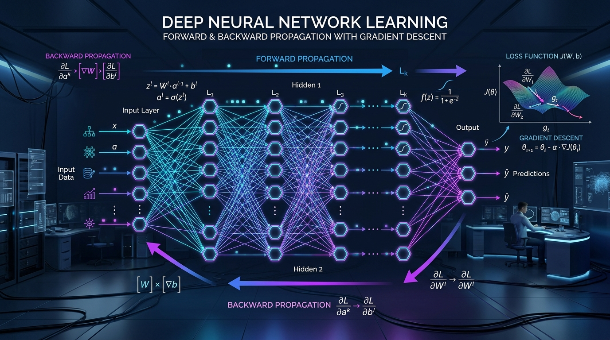

# DNN_GD: Deep Neural Network from Scratch with Gradient Descent

[](https://www.python.org/)
[](https://numpy.org/)
[-red.svg)](#)
[](https://opensource.org/licenses/MIT)

<p align="center">
  
</p>

**DNN_GD**, herhangi bir hazır derin öğrenme kütüphanesi (PyTorch, TensorFlow, Keras) **kullanılmadan**, tamamen **saf NumPy** ve temel matematiksel ilkelerle (first principles) sıfırdan geliştirilmiş **Çok Katmanlı Derin Yapay Sinir Ağı (Multi-Layer Deep Neural Network)** mimarisidir.

Ağ, **İleri Yayılım (Forward Propagation)**, **Geriye Yayılım (Backpropagation)** ve **Gradyan İnişi (Gradient Descent)** algoritmalarını matris düzeyinde uygulayarak öğrenme gerçekleştirir.

---

## 🌟 Öne Çıkan Özellikler

- **Saf Matematik & NumPy:** Harici hiçbir derin öğrenme bağımlılığı yoktur; ağırlık matrisleri, hata türevleri ve gradyan güncellemeleri saf lineer cebir ile yürütülür.
- **Sınırsız Katman Esnekliği (Arbitrary Depth):** `hiddennodes=[6, 12, 8, 4]` gibi tek bir liste vererek istediğiniz derinlikte ve nöron sayısında çok katmanlı ağlar kurabilirsiniz.
- **Xavier / Glorot Benzeri Ağırlık İlklendirmesi:** Ağırlıklar, katman boyutuna bağlı normal dağılımla ilklendirilerek gradyan patlaması/kaybolması engellenir.
- **Zincir Kuralı (Chain Rule) ile Geriye Yayılım:** Her katmandaki hata payı transpoz matris çarpımlarıyla geriye doğru taşınır.

---

## 🧠 Matematiksel Temeller ve Formülasyon

### 1. Ağırlık İlklendirmesi (Weight Initialization)
Her katman arasındaki ağırlık matrisi, önceki katmandaki nöron sayısına ($n_{\text{in}}$) bağlı standart sapmayla normal dağılımdan örneklenir:
$$W^{(l)} \sim \mathcal{N}\left(0, \frac{1}{\sqrt{n_{\text{in}}}}\right)$$

### 2. İleri Yayılım (Forward Propagation)
Her $l$ katmanında, önceki katmanın aktivasyon vektörü ağırlık matrisiyle çarpılır ve Sigmoid fonksiyonundan geçirilir:
$$z^{(l)} = W^{(l)} \cdot a^{(l-1)}$$
$$a^{(l)} = \sigma(z^{(l)}) = \frac{1}{1 + e^{-z^{(l)}}}$$

### 3. Aktivasyon Türevi (Sigmoid Derivative)
Sigmoid fonksiyonunun birinci türevi analitik olarak doğrudan kendi çıktısı cinsinden ifade edilir:
$$\frac{d\sigma(z)}{dz} = \sigma(z) \cdot (1 - \sigma(z)) = a \cdot (1 - a)$$

### 4. Geriye Yayılım ve Hata Dağıtımı (Backpropagation)
- **Çıkış Katmanı Hatası:**
  $$E_{\text{output}} = y - \hat{y}$$
- **Gizli Katman Hataları (Zincir Kuralı):**
  Son katmandan geriye doğru, bir sonraki katmanın ağırlık matrisinin transpozu ile hata çarpılarak bir önceki katmanın payına düşen hata bulunur:
  $$E^{(l)} = (W^{(l+1)})^T \cdot E^{(l+1)}$$

### 5. Gradyan İnişi ile Ağırlık Güncellemesi (Gradient Descent)
Ağırlık güncelleme miktarı ($\Delta W$), öğrenme oranı ($\alpha$), katman hatası ($E^{(l)}$), katman çıktısının türevi ve önceki katmanın girdisi ($a^{(l-1)}$) kullanılarak hesaplanır:
$$\Delta W^{(l)} = \alpha \cdot \left[ E^{(l)} \odot a^{(l)} \odot (1 - a^{(l)}) \right] \cdot (a^{(l-1)})^T$$
$$W^{(l)} \leftarrow W^{(l)} + \Delta W^{(l)}$$

---

## 📁 Proje Dosya Yapısı

```
DNN_GD/
│
├── dnn.py                  # neuralNetwork sınıfı (İlhan Koçaslan'ın orijinal çekirdek kodu)
├── inuse.py                # Orijinal eğitim çalıştırma scripti
├── example.py              # Görsel grafikli, kayıp takipli kapsamlı örnek script
├── run.bat                 # Windows tek tıkla çalıştırma başlatıcısı
├── requirements.txt        # Gerekli kütüphaneler (numpy, matplotlib)
├── README.md               # Detaylı dokümantasyon ve mimari kılavuzu
│
├── assets/
│   └── dnn_architecture.jpg # 3D Yüksek çözünürlüklü yapay sinir ağı mimari şeması
│
└── data/
    └── samples.json        # Örnek çoklu sınıflandırma veri seti
```

---

## 🚀 Hızlı Başlangıç (Quickstart)

### 1. Bağımlılıkların Kurulması
```bash
pip install -r requirements.txt
```

### 2. Örnek Modeli Çalıştırma
Görsel kayıp eğrisi ve tahmin tablosuyla birlikte modeli çalıştırmak için:
```bash
python example.py
```
*(Windows kullanıcıları doğrudan **`run.bat`** dosyasına çift tıklayabilir).*

### Konsol Çıktısı Örneği:
```text
======================================================================
       DNN + GD: Deep Neural Network Trained by Gradient Descent
                 Created from Scratch by İlhan Koçaslan
======================================================================

[*] Network Architecture:
    - Input Features:   5 neurons
    - Hidden Layers:    [6, 8, 4] (3 layers)
    - Output Targets:   3 neurons
    - Total Layers:     [5, 6, 8, 4, 3]
    - Learning Rate:    0.6
    - Training Samples: 6

[+] Training for 800 epochs using Gradient Descent & Backpropagation...
    Epoch [   1/ 800] [-------------------------] - MSE Loss: 0.297015
    Epoch [ 200/ 800] [======-------------------] - MSE Loss: 0.026880
    Epoch [ 400/ 800] [============-------------] - MSE Loss: 0.057155
    Epoch [ 800/ 800] [=========================] - MSE Loss: 0.056170

[OK] Training completed successfully!

======================================================================
                         TEST PREDICTIONS
======================================================================
Sample   Input Pattern          Expected Target    Predicted Output    
----------------------------------------------------------------------
#1       [0, 0, 0, 0, 1]        [0, 1, 0]          [0.017, 0.993, 0.037]
#2       [0, 0, 1, 0, 0]        [1, 0, 0]          [0.996, 0.031, 0.034]
#3       [0, 1, 0, 1, 0]        [0, 0, 1]          [0.519, 0.498, 0.995]
#4       [1, 0, 0, 0, 1]        [0, 1, 1]          [0.003, 0.973, 0.956]
======================================================================
```

---

## 📖 `neuralNetwork` Sınıfı Kullanım Kılavuzu

Orijinal `dnn.py` dosyasını kendi projenizde şu şekilde içe aktararak kullanabilirsiniz:

```python
import dnn

# 1. Modeli tanımla (İstediğiniz derinlikte katman belirtebilirsiniz)
nn = dnn.neuralNetwork(
    inputnodes=5,               # Giriş özellik sayısı
    hiddennodes=[8, 12, 6],     # Gizli katmanların nöron listesi (3 gizli katman)
    outputnodes=3,              # Çıkış nöron sayısı
    learningrate=0.5            # Öğrenme katsayısı (alpha)
)

# 2. Modeli eğit
inputs = [[0, 0, 0, 0, 1], [1, 1, 1, 1, 0]]
targets = [[0, 1, 0], [1, 1, 1]]

for epoch in range(500):
    nn.train(inputs_list=inputs, targets_list=targets)

# 3. Yeni veri üzerinde tahmin al
nn.query([[0, 0, 0, 0, 1]])
```

---

## ⚔️ Karşılaştırma: `DNN_GD` vs `DNN_PSO`

Yazarın geliştirdiği iki farklı yapay sinir ağı yaklaşımının mimari kıyaslaması:

| Karşılaştırma Kriteri | **DNN_GD** (Bu Proje) | **[DNN_PSO](https://github.com/Proaiml/DNN_PSO)** |
| :--- | :--- | :--- |
| **Optimizasyon Yöntemi** | Geriye Yayılım (Backpropagation) | Parçacık Sürü Optimizasyonu (PSO) |
| **Ağırlık Güncellemesi** | Gradyan İnişi ($\nabla Loss$) | Sürü En İyisi ($G_{\text{best}}, P_{\text{best}}$) |
| **Türev İhtiyacı** | Zorunlu (Zincir Kuralı) | **Türevsiz (Derivative-Free)** |
| **Hesaplama Hızı** | Çok Hızlı (Matris Çarpımı) | Popülasyon tabanlı simülasyon |
| **Yerel Minimum Riski** | Var (Eyer noktaları/Yerel çukurlar) | Çok Düşük (Sürü küresel arama yapar) |

---

## 👨‍💻 Yazar & Destek

- **İlhan Koçaslan** — [GitHub: @Proaiml](https://github.com/Proaiml)
- **BNB Smart Chain (BEP20) Cüzdan:** `0x89943b0a0f43fc6cd3ce9a8c19718485dcaf0bb7`
